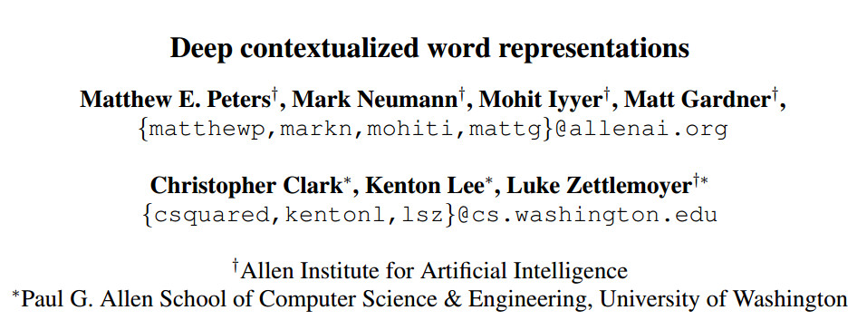
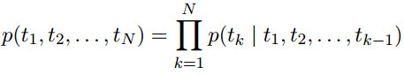
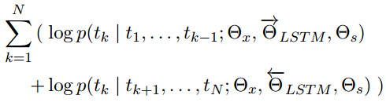
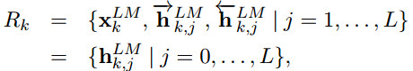
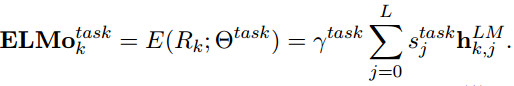
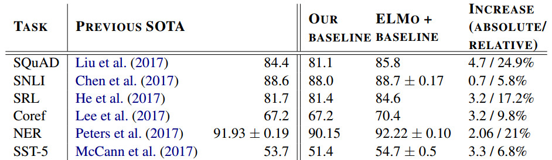
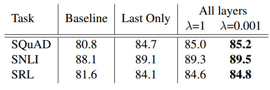
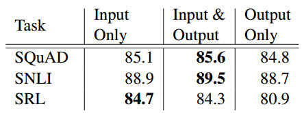
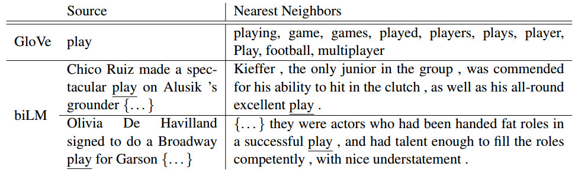

#  elmo

## 1. introduce
作者认为一个好的词表征模型应该兼顾这两个问题：(1)词语用法在语法和语义上的复杂特点;(2)随着上下文语境的变化，这些用法也随之改变。基于此，作者提出了deep contextualized word representation来进行解决。  

elmo模型和传统方法的不同的是每一个词语的表征都是整个输入语句的函数。做法是先在大规模语料库上以language model为目标函数训练双向LSTM模型，然后利用双向LSTM产生词语的表征。ELMO因而得名为embedding form language model。  

elmo表征是“深 ”的，它们是bilm所有中间层表征的函数，这样做的好处可以产生丰富的词语特征。高层的LSTM可以捕捉与上下文语境相关的词语意义(如用来做语义的消歧)，而低层的LSTM可以捕获语法方面的特征(如可以做词性标注)。如果把它们结合在一起，在下游的NLP任务中会体现优势  

## 2. elmo(Embeddings from Language Models)
### 2.1 Bidirectional language models
给定一个长度为N的序列$(t_1,t_2,t_3......t_N)$ ,forward language model计算序列的概率公式如下：

常用的语言模型是使用用多层的LSTM，elmo的语言模型也采用了这种方式  
假设输入层级LSTM的token $x_k$上下文无关表征为$x_k^{LM}$(通过word embedding或基于字的CNN得到)，在每一个位置k，每个LSTM输出的基于上下文的表征为$\overrightarrow{h}_{k,j}^{LM}$(j=1,2.....L)，最后利用顶层的输出$\overrightarrow{h}_{k,L}^{LM}$，通过sofamax来预测下一个token $x_{k+1}$

同样地，backward LM的计算公式如下：

最后biLM的log likelihood表达式如下：

### 2.2 elmo
对于每一个token$x_k$,一个L层的biLM要计算2L+1个表征：

其中，$h_{k,0}^{LM}$是token layer，$h_{k,j}^{KM}=[\overrightarrow{h}_{k,j}^{KM};\overleftarrow{h}_{k,j}^{KM}]$表示每一个biLM layer

在下游任务的使用中，ELMO是将R中的所有层压缩在一起形成一个单独的向量$ELMO_k=E(R_k,\Theta_e)$,最简单的情况下，仅使用top layer，即$E(R_k)=h_{k,L}{LM}$

更一般地，我们计算所有biLM层的任务特定权重：

其中$s^task$是softmax归一化权重，常量参数$\gamma^task$是任务模型对整个ELMO向量的缩放，$\gamma$在优化过程中有着实际的意义，由于每个biLM层有不同的分布，某些情况下，它还有助于在加权之前对每个biLM进行归一化。

### 2.3 Using elmo for supervised NLP tasks
1.产生pre-trained biLM  
ELMO中的biLM是由两层biLSTM构成，第一层到第二层使用残差连接(residual connection),biLSTM的单元数为4096，映射维度维512。biLM的输入为2048character n-gram CNN+2层highway+线性映射为512维

2.利用ELMo的word embedding来对任务进行训练。通常的做法是在任务模型embedding层加入ELMO向量，先冻结biLM中的权重，然后将biLM得到的elmo向量和任务模型之前的向量拼接在一起$[x_k,ELMO_k^{task}]$

一旦pretrained,一些情况下，在任务语料上(注意是语料，忽略label)fine tuningbiLM模型，可以把这一步看为biLM的domain transfer，能够提高下游任务的性能

## 3.Evaluation and Analysis
以下是ELMO在QA,Textual entailment，Semanic role labeling, Coreference resolution, NER 和 Sentiment analysis上的结果,基本上每个任务都有明显的改善

使用所有层和顶层的对比

较大的$\lambda$(如$\lambda=1$)将加权函数变为基于层的简单平均值，而较小的$lambda$(如$\lambda=0.001$)允许层权重变化

ELMO放在输入层和输出层的对比

What information is captured by the biLM’s representations?

从图上可知，对于单词play，glove返回的近义词包括动词(played,playing)，名词(player,game)等词，主要是运动方面的词语。elmo返回的结果可以知道biLM能够在表示词语嵌入时考虑到context的信息(第一个例子里的play名词，表示击球，第二个例子中play也是名词，表示表演)。biLM能够同时区分语法和语义。

## 4.实际使用
1.英文官方源码elmo使用请见[https://github.com/allenai/bilm-tf](https://github.com/allenai/bilm-tf)

2.哈工大elmo[https://github.com/HIT-SCIR/ELMoForManyLangs](https://github.com/HIT-SCIR/ELMoForManyLangs)

3.[使用Glove/word2vec初始化向量](http://www.linzehui.me/2018/08/12/%E7%A2%8E%E7%89%87%E7%9F%A5%E8%AF%86%E7%82%B9/%E5%A6%82%E4%BD%95%E5%B0%86ELMo%E8%AF%8D%E5%90%91%E9%87%8F%E7%94%A8%E4%BA%8E%E4%B8%AD%E6%96%87/)